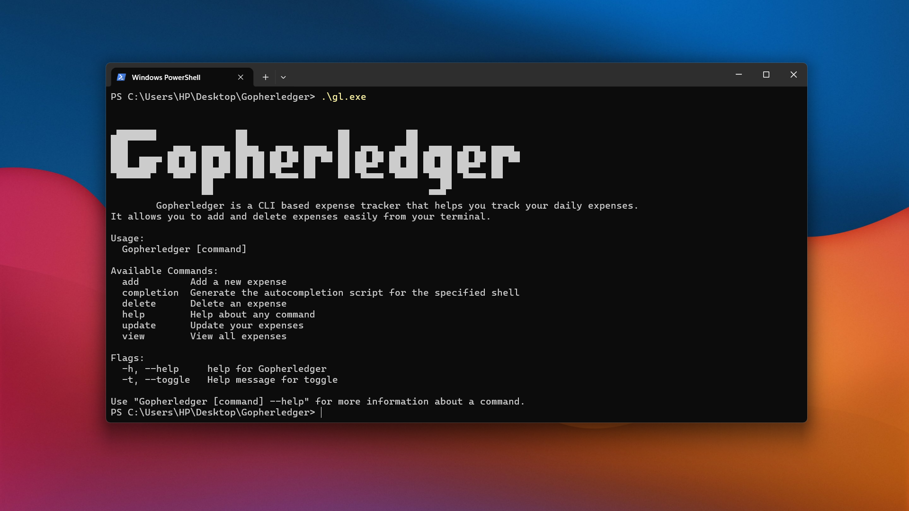

# Gopherledger



Gopherledger is a simple, CLI-based expense tracker built with Go. It helps you manage your daily expenses directly from your terminal.

## Installation

To install Gopherledger, ensure you have Go installed on your machine. Then, clone the repository and build the binary:

```bash
git clone https://github.com/udaykumar-dhokia/Gopherledger.git
cd Gopherledger
go build -o gl
```

You can move the `gl` binary to a directory in your system's PATH to use it globally.

## Usage

### Add an Expense

Use the `add` command to record a new expense. You must specify the amount using the `--amount` (or `-a`) flag. Optionally, you can add a note with `--note` (or `-n`).

```bash
# Add an expense of 100
./gl add --amount 100

# Add an expense with a note
./gl add --amount 50 --note "Coffee"

# Using shorthand flags
./gl add -a 25.50 -n "Taxi"
```

### Update an Expense

Use the `update` command to modify an existing expense. You must specify the ID of the expense using the `--id` (or `-i`) flag. You can then update the amount with `--amount` (or `-a`) and the note with `--note` (or `-n`).

```bash
# Update transaction with ID 123 with a new amount and note
./gl update --id 123 --amount 150 --note "Lunch"

# Update only the amount
./gl update -i 123 -a 200

# Update only the note
./gl update -i 123 -n "Dinner"
```

### Delete an Expense

Use the `delete` command to remove an expense by its ID. You can find the ID of an expense by listing them.

```bash
# Delete transaction with ID 123
./gl delete --id 123

# Using shorthand flag
./gl delete -i 123
```

### View Expenses

Use the `view` command to list expenses. You can view all expenses, filter by year, or see details of a specific expense by ID. You can also filter expenses by amount.

```bash
# View all expenses
./gl view --all

# View expenses for a specific year
./gl view --year 2024

# View a specific expense by ID
./gl view --id 123

# View expenses greater than a certain amount
./gl view --greater 100

# View expenses less than a certain amount
./gl view --less 50

# Using shorthand flags
./gl view -a
./gl view -y 2024
./gl view -i 123
./gl view -g 100
./gl view -l 50
```

## Storage

Expenses are stored locally in a `expenses.json` file.

---

Made with ❤️ by [Udaykumar Dhokia](https://github.com/udaykumar-dhokia) using Go.
